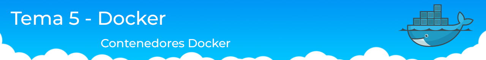

 

# Servicios de Red e Internet
Este repositorio incluye actividades llevadas a cabo en el módulo Servicios de Red e Internet

## Indice

- [Introducción ](./Tema%200/Ejercicios.md)
- [Servidores Web ](./Tema%201/Ejercicios.md)
- [Domain Name System (DNS)](./Tema%202/Ejercicios.md)
- [Contenedores en la nube - Docker](./Tema%205%20-%20Docker/ejercicios.md)
- [Amazon Web Services (AWS)](./Tema%204%20AWS/Ejercicios.md)
- [Práctica](./Practica%201º%20Trimestre/Practica1.md)

## Contenidos del repositorio

 

 

| Nº Ejercicio | Descripción  |
|:-:|:-:|
| 1 | [Introducción básica para el entendimiento de la asignatura.](./Tema%200/Ejercicios.md#ejercicio-1---introducción-)| 
| 2 | [Cuestiones que buscan comparar los protocolos TCP y UDP.](./Tema%200/Ejercicios.md#ejercicio-2---udp-and-tcp-comparison-of-transport-protocol-) |
| 3 | [Ejercicio práctico probando conexiones con el cliente Telnet.](./Tema%200/Ejercicios.md#ejercicio-3---práctica-telnethttp-) |
| 4 | [Uso del comando cURL.](./Tema%200/Ejercicios.md#ejercicio-4---usando-curl-) |
| 5 | [Práctica donde se prueban diferentes formas de crear servidores web.](./Tema%200/Ejercicios.md#ejercicio-5---práctica-a-servidor-web-) |

 
 

 

| Nº Ejercicio | Descripción  |
|:-:|:-:|
| 1 | [Pasos a seguir en la instalación de Apache](./Tema%201/Ejercicios.md#actividad-1)  |
| 2 | [Uso de scripts en la configuración básica de Apache](./Tema%201/Ejercicios.md#actividad-2)  |
| 3 | [Uso del módulo Rewrite de Apache permitiendo redirecciones](./Tema%201/Ejercicios.md#habilitando-el-módulo-rewrite)  |
| 4 | [Módulo de Autenticación en Apache (configuración)](./Tema%201/Ejercicios.md#creación-de-usuarios) |
| 5 | [Certificados autofirmados SSL](./Tema%201/Ejercicios.md#)  |

 
 

 

| Nº Ejercicio | Descripción  |
|:-:|:-:|
| 1 | [Nslookup](./Tema%202/Ejercicios.md)  |
| 2 | [Bind9](./Tema%202/Ejercicios.md)  |
    

 
 

 

| Nº Ejercicio | Descripción  |
|:-:|:-:|
| 1 | [Introducción](./Tema%205%20-%20Docker/ejercicios.md)  |
| 2 | [Actividad 2](./Tema%205%20-%20Docker/ejercicios.md#Actividad-2)  |
| 3 | [Actividad 3](./Tema%205%20-%20Docker/ejercicios.md)  |
| 4 | [Actividad 4](./Tema%205%20-%20Docker/ejercicios.md)  |
| 5 | [Actividad 5](./Tema%205%20-%20Docker/ejercicios.md)  |

    

 
 

 

| Nº Ejercicio | Descripción  |
|:-:|:-:|
| 1 | [Introducción](./Tema%204%20AWS/Ejercicios.md#Introducción)  |
| 2 | [Creación de instancias](./Tema%204%20AWS/Ejercicios.md#creación-de-instancias)  |
| 3 | [Apache y PHP](./Tema%204%20AWS/Ejercicios.md#apache-y-php)  |
| 4 | [Creación de la base de datos](./Tema%204%20AWS/Ejercicios.md#creación-de-la-base-de-datos)  |
| 5 | [Elastic File System (EFS)](./Tema%204%20AWS/Ejercicios.md#elastic-file-system-efs)  |
| 6 | [Descarga de Wordpress](./Tema%204%20AWS/Ejercicios.md#descarga-de-wordpress)  |
    

 
 

 

| Nº Práctica | Nombre  |
|:-:|:-:|
| 1 | [Servidores Web, instalación y configuración](./Practica%201º%20Trimestre/Practica1.md)| 
