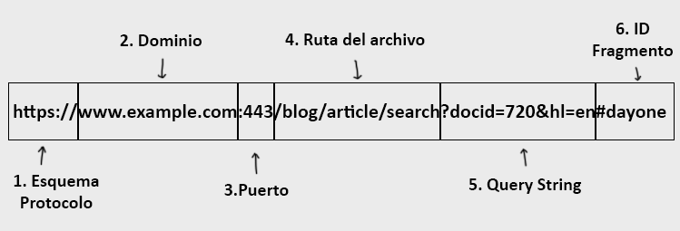
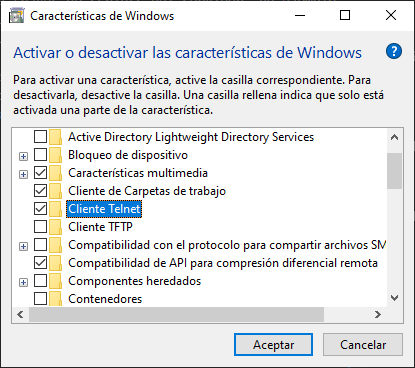

# Tema 0 - Introducción a HTTP 

## Indice

- [Inicio ](../README.md)
- [Tema 0 - Introducción ](#indice)
    - [Ejercicio 1 - Introducción ](#ejercicio-1---introducción-)
    - [Ejercicio 2 - Comparativa entre UDP y TCP](#ejercicio-2---udp-and-tcp-comparison-of-transport-protocol-)
    - [Ejercicio 3 - Práctica de Telnet/HTTP](#ejercicio-3---práctica-telnethttp-)
    - [Ejercicio 4 - Usando cURL](#ejercicio-4---usando-curl-)
    - [Ejercicio 5 - Práctica a Servidor Web](#ejercicio-5---práctica-a-servidor-web-)
- [Tema 1 - Servidores Web ](#Tema-1-Servidores-Web)
- [Tema 2 - Placeholder ](#Tema-X-Placeholder)
- [Tema 3 - Placeholder ](#Tema-X-Placeholder)

 

## Ejercicio 1 - Introducción :

 

### ¿Quién, dónde y cuándo se crea el primer servidor web?
 

- Tim Berners-Lee junto a Robert Cailliau fueron los creadores del primer servidor web, se creó entre 1989 y 1990 en el CERN (Conseil Européen pour la Recherche Nucléaire o Organización Europea para la Investigación Nuclear).

 

### ¿Qué es pila de protocolos usados por http?

 

- TCP/IP

 

### ¿Componentes de una URL?

 

 

1. Esquema/Protocolo que utiliza.
2. Nombre del dominio.
3. El puerto que utiliza (suele ser opcional, salvo casos como redes internas)
4. La ruta del archivo solicitado, tanto el nombre como su extensión de archivo.
5. La Query String dónde quedan registrados diferentes parámetros útiles para el trabajo con la base de datos. Suele ser opcional.
6. También veremos ID’s relacionadas con localizaciones dentro de un mismo archivo (por ejemplo en el caso del contenido relacionado de un índice en un manual de instrucciones.) También es un componente opcional por su naturaleza.

 

### ¿Pasos en la recuperación de una página web mediante HTTP?
- Se lanza una consulta desde el lado del cliente, la consulta consiste en un datagrama compuesto por un método(comando) una URI y la versión HTTP utilizada. Se recibe la consulta y el servidor la analiza y responde bien con un mensaje dónde se da a conocer el proceso funcionó junto con el archivo solicitado o bien un mensaje de error.

 

### Diferencia entre páginas dinámicas y estáticas
- Las páginas dinámicas se generan en el momento a través de scripts del servidor, un ejemplo es la página de búsqueda de Google. Mientras que una estática es una página que siempre permanece igual independiente de los parámetros que se le lancen.

 

### ¿Cómo usar telnet para acceder a un servidor web?
- Activamos el cliente Telnet en caso de que no lo tengamos activado. Para ello accedemos a ***"Activar o desactivar las características de Windows"*** y buscamos la opción de **cliente de Telnet**.

 

 

- Con Telnet ya activado, abrimos la línea de comandos y ejecutamos el comando de **Telnet** para comunicarnos con un servidor web, lo hacemos con el siguiente comando

``telnet Nombre_Dominio Puerto
``

Podemos acompañar con la ejecución del comando, una petición a través de ***GET***, lo que nos daría información relativa a la comunicación que hemos establecido. En la siguiente imagen vemos un ejemplo.

 

### Request. Métodos principales
- GET y POST

 

### Response. Códigos

 

| Nº Código | Descripción  |
|---|---|
| 100-199 |  Respuesta informativa |
| 200-299 | Respuesta satisfactoria |
| 300-399 | Redirección |
| 400-499 | Error del cliente |
| 500-599 | Erro del servidor |

 

### Content type. Tipos principales
- Texto / HTML

 

## Ejercicio 2 - UDP and TCP. Comparison of Transport Protocol :

**Diferencias entre UDP y TCP**
- TCP es más lento pero asegura que la información llegue completa y en el orden correcto, mientras que UDP es más rápido porque no asegura la transmisión completa de los datos así como del orden de llegada de estos.

**¿Qué aplicaciones usan TCP?**
- HTTP, FTP, SMTP, Telnet entre otras.

**¿Qué aplicaciones usan UDP?**
- DNS, TFTP (Trivial Files Transmission Protocol), NFS (NetWork File System), NCS (NetWork-Based Call Signaling).

**¿Qué capa almacena el puerto?**
- La capa número 4, la capa de Transporte.

**¿Qué capa almacena la IP?**

- La capa número 3, la capa de Red.

**¿Qué es Three-way Handshake?**

- Proceso en el que se establece una conexión segura entre dos dispositivos/máquinas a través de una red de conexión TCP/IP confirmando que ambas partes se encuentras listas para la comunicación.

## Ejercicio 3 - Práctica Telnet/HTTP :

**p**

## Ejercicio 4 - Usando cURL :

El comando cURL abreviatura de ***Client URL*** nos permite conectarnos a una URL y demostrar así la conectividad que mantenemos con esta URL. Además este comando nos permite una serie de opciones:

- **-O**
- **-O**
- **-O**
- **-O**

``
cURL 'Nombre del dominio' > Nombre_archivo.html
``

## Ejercicio 5 - Práctica a Servidor Web :

**p**
