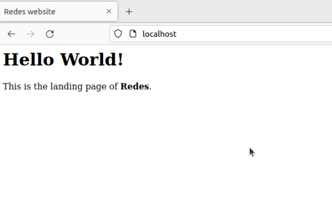
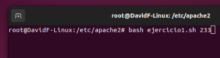
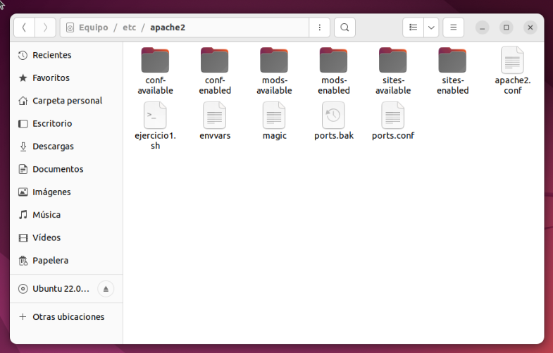
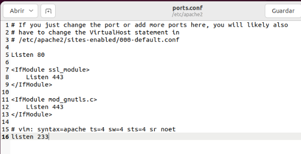
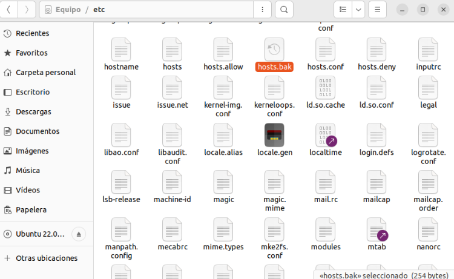
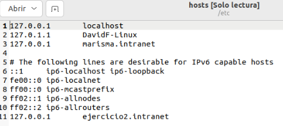

# Tema 1 - Servidores Web

## Indice

- [Inicio ](../README.md)
- [Tema 0 - Introducción ](../Tema%200/Ejercicios.md)
- [Tema 1 - Servidores Web ](#indice)
  - [Actividad #1](#)
    - [Instalación de Apache ](#)
    - [Instalación de MySQL ](#)
    - [Instalación de PHP ](#)
    - [Creación de un Host Virtual para la página](#)
  - [Actividad #2](#)
- [Tema 2 - Placeholder ](#Tema-X-Placeholder)
- [Tema 3 - Placeholder ](#Tema-X-Placeholder)

## Actividad #1

### La arquitectura Web es un modelo compuesto de tres capas, ¿cuáles son y cuál es  la función de cada una de ellas?

### Una plataforma web es el entorno de desarrollo de software empleado para  diseñar y ejecutar un sitio web; destacan dos plataformas web, LAMP y WISA. Explica en qué consiste cada una de ellas.

### Instalación de Apache en Ubuntu

1.

````
sudo -i
````
`````
apt update
`````

`````
apt install apache2
`````

`````
ufw app list
`````

`````
ufw allow "Apache"
`````

``
https://localhost
``

### Instalación de MySQL

`````
apt install mysql-server
`````

`````
mysql // exit
`````

### Instalación de PHP

````
sudo apt install php libapache2-mod-php php-mysql
````

````
php -v
````

### Creación de un Host Virtual para la página

````
mkdir /var/www/your_domain
````

````
chown -R $USER:$USER /var/www/your_domain
````

````
nano /etc/apache2/sites-available/your_domain.conf
````

````
<VirtualHost *:80>
    ServerName your_domain
    ServerAlias www.your_domain
    ServerAdmin webmaster@localhost
    DocumentRoot /var/www/your_domain
    ErrorLog ${APACHE_LOG_DIR}/error.log
    CustomLog ${APACHE_LOG_DIR}/access.log combined
</VirtualHost>
````

````
a2ensite your_domain
````

````
a2dissite 000-default
````

````
apache2ctl configtest
````

````
systemctl reload apache2
````
````
nano /var/www/your_domain/index.html
````
````
<html>
  <head>
    <title>your_domain website</title>
  </head>
  <body>
    <h1>Hello World!</h1>

    <p>This is the landing page of <strong>your_domain</strong>.</p>
  </body>
</html>
````

<br>



<br>

### Probando PHP en el Servidor Web

Vamos a crear un documento PHP de prueba con el que confirmar que PHP se encuentra instalado y en funcionamiento, para ello escribimos el siguiente comando en la terminal de Linux.

````
nano /var/www/Nombre_Dominio/info.php
````

Ahora con el editor de texto abierto, creamos las siguientes líneas dentro del documento:

````
<?php
phpinfo();
````

Finalmente guardamos los cambios del documento con **CTRL + O** y lo cerramos con **CTRL + X**. Ahora simplemento añadimos a nuestra URL habitual el sufijo ***/info.php***, quedaría nuestra URL de la siguiente forma:

````
localhost/info.php
````

<br>


## Actividad #2

### 1. Creación de un script que añada un puerto de escucha en el fichero de configuración de Apache

#### Accedemos a la carpeta de donde se contiene la configuración de Apache.

````bash
cd /etc/apache2
````

#### Creamos y editamos el script en el que realizaremos las acciones.

````bash
gedit ejercicio1.sh
````

Se abrira una nueva ventana, el editor de textos para nuestro script. En él desarrollamos el siguiente código:

````bash
#!/bin/bash

if [ $# -eq  0 ]; then
  echo 'Error';                     # Se comrpueba que existe parametro
else
  grep "$1" ports.conf              # Con el comando grep comprobamos si
                                    # existe el puerto pasado por parametro
  
  if [ $? -ne 0 ]; then             # El parametro $? es un booleano que 
                                    # guarda información del ultimo comando

    cp ports.conf ports.bak         # Hace una copia de seguridad
    echo "listen $1" >> ports.conf  # Añade a ports.conf el puerto pasado por parametro
  else
    echo 'El puerto de escucha ya existe'
  fi
fi
````

#### Prueba del código

Comenzamos ejecutando el siguiente comando (Hay que tener en cuenta donde estamos posicionados):

````bash
bash NombreScript.sh NumeroPuerto
````



<br>Al ejecutarlo podemos comprobar que al no ser un puerto existente se ha creado primero un respaldo del archivo.</br>



<br> Si nos vamos al archivo de ports.conf podemos comprobar el puerto se ha añadido.



### 2. Creación de un script que añada un nombre de dominio y una ip en el fichero hosts.

#### Accedemos a la carpeta de donde se contiene el fichero hosts.

````bash
cd /etc/
````

#### Creamos y editamos el script en el que realizaremos las acciones.

````bash
sudo gedit ejercicio2.sh
````
Se abrira una nueva ventana, el editor de textos para nuestro script. En él desarrollamos el siguiente código:

````bash
#!/bin/bash

if [ $# -eq  0 ]; then
  echo 'Error';                     # Se comrpueba que existe parametro
else
  grep "$1" hosts                   # Con el comando grep comprobamos si
                                    # existe el dominio pasado por parametro
  
  if [ $? -ne 0 ]; then             # El parametro $? es un booleano que 
                                    # guarda información del ultimo comando

    cp hosts hosts.bak         # Hace una copia de seguridad
    echo "$2  $1" >> hosts     # Añade a hosts el dominio y la IP pasados por parametro
  else
    echo 'El dominio ya existe'
  fi
fi

````

#### Prueba del código

Comenzamos ejecutando el siguiente comando (Hay que tener en cuenta donde estamos posicionados):

````bash
bash NombreScript.sh NombreDominio IP
````


<br>Al ejecutarlo podemos comprobar que al no ser un puerto existente se ha creado primero un respaldo del archivo.</br>



<br> Si nos vamos al archivo de hosts podemos comprobar que el dominio se ha añadido.




