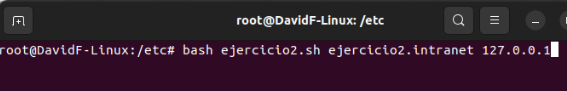
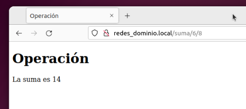
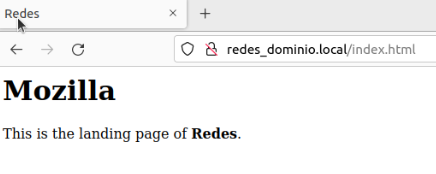

# Tema 1 - Servidores Web

## Indice

- [Inicio](../README.md)
- [Tema 0 - Introducción](../Tema%200/Ejercicios.md)

- <details><summary>Tema 1 - Servidores Web</summary>

  <details>
  <summary>Actividad #1</summary>
  
  - [Instalación de Apache](#instalación-de-apache-en-ubuntu)
  - [Instalación de MySQL](#instalación-de-mysql)
  - [Instalación de PHP](#instalación-de-php)
  - [Creación de un Host Virtual para la página](#creación-de-un-host-virtual-para-la-página)

  </details>

  <details><summary>Actividad #2</summary>

  - [Script #1](#1-creación-de-un-script-que-añada-un-puerto-de-escucha-en-el-fichero-de-configuración-de-apache)
  - [Script #2](#2-creación-de-un-script-que-añada-un-nombre-de-dominio-y-una-ip-en-el-fichero-hosts)
  - [Script #3](#3-crea-un-script-que-nos-permita-crear-una-página-web-con-un-título-una-cabecera-y-un-mensaje)

  </details>

  <details>
  <summary>Actividad #7 - Rewrite</summary>

  - [Habilitar Móddulo](#habilitando-el-módulo-rewrite)
  - [Creación de un .htacces](#crear-un-htacces-para-rewrite)
  - [Redirección con cambio de extensión](#redirección-url-con-diferente-extensión) 
  - [URL amigable](#url-amigable)
  - [Redirección a página externa](#redireccionar-a-una-página-externa)
  - [Redirección según navegador](#redireccionar-según-el-navegador-utilizado)

  </details>

</details>

- [Tema 2 - Placeholder](#Tema-X-Placeholder)
- [Tema 3 - Placeholder](#Tema-X-Placeholder)
## Actividad #1

### La arquitectura Web es un modelo compuesto de tres capas, ¿cuáles son y cuál es  la función de cada una de ellas?
<br>

|     Capa     |          Función             |
|:------------:|:----------------------------:|
| Presentación | Muestra una interfaz para el usuario y por la que este interactuará con la web  |
| Aplicación   | Procesa la parte lógica con los datos proporcionados de las otras dos capas |
| Datos        | Almacena y gestiona los datos procesados en una base de datos  |

<br>
<br>

### Una plataforma web es el entorno de desarrollo de software empleado para  diseñar y ejecutar un sitio web; destacan dos plataformas web, LAMP y WISA. Explica en qué consiste cada una de ellas.
<br>

 - LAMP - Infraestructura web que utiliza **Linux, Apache, MySQL y PHP**

 <br>
 
 - WISA - Infraestructura web que utiliza **Windows, IIS, SQL y ASP.NET**

 <br>
 <br>

### Instalación de Apache en Ubuntu

1. Abrimos una terminal y logeamos como root

````
sudo -i
````
2. Actualizamos los paquetes instalados
`````
apt update
`````
3. Instalamos las nuevas versiones
````
apt upgrade
````
4. Instalamos el paquete de Apache
`````
apt install apache2
`````
5. Ajustamos el Firewall para Apache con los siguientes dos comandos:
`````
ufw app list
`````
`````
ufw allow "Apache"
`````
6. Comprobar en nuestro navegador la siguiente dirección
````
https://localhost
````
Si hemos seguido los pasos habremos instalado correctamente Apache2 para Ubuntu


<br>

### Instalación de MySQL

1. Instalamos MySQL-server

`````
apt install mysql-server
`````
2. Comprobamos, entrando a MySQL con el siguiente comando:
`````
sudo mysql 
`````
3. Para salir de MySQL:
`````
exit
`````
<br>

### Instalación de PHP
1. Instalamos PHP
````
sudo apt install php libapache2-mod-php php-mysql
````
2. Comprobar la version de PHP
````
php -v
````
<br>

### Creación de un Host Virtual para la página

1. Creamos el directorio para nuestro dominio.
````
mkdir /var/www/your_domain
````
2. Asignamos como propietario al usuario.
````
chown -R $USER:$USER /var/www/your_domain
````
3. Configuramos nuestro dominio con el siguiente comando:
````
nano /etc/apache2/sites-available/your_domain.conf
````
4. Una vez ejecutado el comando anterior, podremos editar el documento de configuración. Guardamos con **CTRL + O** y **CTRL + X**
````
<VirtualHost *:80>
    ServerName your_domain
    ServerAlias www.your_domain
    ServerAdmin webmaster@localhost
    DocumentRoot /var/www/your_domain
    ErrorLog ${APACHE_LOG_DIR}/error.log
    CustomLog ${APACHE_LOG_DIR}/access.log combined
</VirtualHost>
````
5. Habilitamos el dominio
````
a2ensite your_domain
````
**Opcional** - Deshabilitar el dominio por defecto de PHP.
````
a2dissite 000-default
````
6. Comprobamos que nuestra configuracion no tenga problemas de sintaxis
````
apache2ctl configtest
````
7. Cargamnos los cambios en Apache.
````
systemctl reload apache2
````
8. Modificamos la pagina principal de nuestro dominio.
````
nano /var/www/your_domain/index.html
````
````
<html>
  <head>
    <title>your_domain website</title>
  </head>
  <body>
    <h1>Hello World!</h1>

    <p>This is the landing page of <strong>your_domain</strong>.</p>
  </body>
</html>
````
Resultado del html anterior en nuesto dominio:
<br>


<br>

### Probando PHP en el Servidor Web

Vamos a crear un documento PHP de prueba con el que confirmar que PHP se encuentra instalado y en funcionamiento, para ello escribimos el siguiente comando en la terminal de Linux.

````
nano /var/www/Nombre_Dominio/info.php
````

Ahora con el editor de texto abierto, creamos las siguientes líneas dentro del documento:

````
<?php
phpinfo();
````

Finalmente guardamos los cambios del documento con **CTRL + O** y lo cerramos con **CTRL + X**. Ahora simplemento añadimos a nuestra URL habitual el sufijo ***/info.php***, quedaría nuestra URL de la siguiente forma:

````
localhost/info.php
````

<br>


## Actividad #2

### 1. Creación de un script que añada un puerto de escucha en el fichero de configuración de Apache

#### Accedemos a la carpeta de donde se contiene la configuración de Apache.

````bash
cd /etc/apache2
````

#### Creamos y editamos el script en el que realizaremos las acciones.

````bash
gedit NombreScript.sh
````

Se abrira una nueva ventana, el editor de textos para nuestro script. En él desarrollamos el siguiente código:

````bash
#!/bin/bash

if [ $# -eq  0 ]; then
  echo 'Error';                     # Se comprueba que existe parametro
else
  grep "$1" ports.conf              # Con el comando grep comprobamos si
                                    # existe el puerto pasado por parametro
  
  if [ $? -ne 0 ]; then             # El parametro $? es un booleano que 
                                    # guarda información del ultimo comando

    cp ports.conf ports.bak         # Hace una copia de seguridad
    echo "listen $1" >> ports.conf  # Añade a ports.conf el puerto pasado por parametro
  else
    echo 'El puerto de escucha ya existe'
  fi
fi
````

#### Prueba del código

Comenzamos ejecutando el siguiente comando (Hay que tener en cuenta donde estamos posicionados):

````bash
bash NombreScript.sh NumeroPuerto
````


<br>Al ejecutarlo podemos comprobar que al no ser un puerto existente se ha creado primero un respaldo del archivo.</br>


<br> Si nos vamos al archivo de ports.conf podemos comprobar el puerto se ha añadido.


<br>
<br>

### 2. Creación de un script que añada un nombre de dominio y una ip en el fichero hosts.

#### Accedemos a la carpeta de donde se contiene el fichero hosts.

````bash
cd /etc/
````

#### Creamos y editamos el script en el que realizaremos las acciones.

````bash
sudo gedit NombreScript.sh
````
Se abrira una nueva ventana, el editor de textos para nuestro script. En él desarrollamos el siguiente código:

````bash
#!/bin/bash

if [ $# -eq  0 ]; then
  echo 'Error';                     # Se comprueba que existe parametro
else
  grep "$1" hosts                   # Con el comando grep comprobamos si
                                    # existe el dominio pasado por parametro
  
  if [ $? -ne 0 ]; then             # El parametro $? es un booleano que 
                                    # guarda información del ultimo comando

    cp hosts hosts.bak         # Hace una copia de seguridad
    echo "$2  $1" >> hosts     # Añade a hosts el dominio y la IP pasados por parametro
  else
    echo 'El dominio ya existe'
  fi
fi

````

#### Prueba del código

Comenzamos ejecutando el siguiente comando (Hay que tener en cuenta donde estamos posicionados):

````bash
bash NombreScript.sh NombreDominio IP
````



<br>Al ejecutarlo podemos comprobar que al no ser un puerto existente se ha creado primero un respaldo del archivo.</br>


<br> Si nos vamos al archivo de hosts podemos comprobar que el dominio se ha añadido.


<br>
<br>

### 3. Crea un script que nos permita crear una página web con un título, una cabecera y un mensaje.

#### Accedemos a la carpeta de donde se contiene los dominios y los htmls.

````bash
cd /var/www/
````

#### Creamos y editamos el script en el que realizaremos las acciones.

````bash
sudo gedit NombreScript.sh
````
Se abrira una nueva ventana, el editor de textos para nuestro script. En él desarrollamos el siguiente código:

````bash
#!/bin/bash

# Existen 4 parametros 1- Nombre Dominio || 2- Titulo || 3- Encabezado || 4- Mensaje 

if [ $# -eq  0 ]; then
  echo 'Error';                     # Se comprueba que existen parametros
else

  FILE="/var/www/$1/$2.html"        # Ruta donde se guardan archivos html
  if [ ! -f "$FILE" ]; then         # Se comprueba que no existe el archivo html a crear
                                    
    if [ -d "$1" ]; then            # Se comprueba que existe el directorio del dominio
      echo "<!doctype html>" > $1/$2.html     
      echo "<html>" >> $1/$2.html
      echo -e "\t<head>" >> $1/$2.html
      echo -e "\t\t<title>$2</title>" >> $1/$2.html
      echo -e "\t</head>" >> $1/$2.html
      echo -e "\t<body>" >> $1/$2.html
      echo -e "\t\t<h1>$3</h1>" >> $1/$2.html
      echo -e "\t\t<p>$4</p>" >> $1/$2.html
      echo -e "\t</body>" >> $1/$2.html
      echo "<html>" >> $1/$2.html
    else
      echo "El dominio $1 no existe"
    fi
  else
    echo "La pagina $2 ya existe"
  fi
fi

````

#### Prueba del código

Comenzamos ejecutando el siguiente comando (Hay que tener en cuenta donde estamos posicionados):

````bash
bash NombreScript.sh NombreDominio Titulo/NombrePagina Encabezado Mensaje 
````


<br>Podemos observar que nuestra pagina se crea correctamente</br>


<br>Si ingresamos en nuestro navegador la URI correcta, vemos que funciona tal y como se describe


## Actividad #7 - Rewrite

Este módulo de Apache habilita la capacidad de reescribir URLs mediante el uso de expresiones regulares

**NOTA: Debemos habilitar el módulo en Apache para poder utilizarlo**

### Habilitando el módulo Rewrite

En una terminal escribiremos:
````
a2enmod rewrite
````

### Crear un .htacces para Rewrite

Existen múltiples formas de habilitar este módulo en nuestro dominio, en este caso se utilizará un archivo .htaccess, para ello primero accederemos al archivo de configuración de apache.

````
nano /etc/apache2/apache2.conf
````
Buscamos la línea <Directory /var/www/> y escribimos:
````
<Directory /var/www/>
  AllowOverride all
````


<br>
<br>

Nos tocará reiniciar Apache para que los cambios tengan efecto:

````
systemctl restart apache2 
````

Ahora podremos crear nuestro archivo .htaccess en el que escribiremos nuestras reglas de Rewrite. Lo creamos en la carpeta de nuestro dominio, será importante como mínimo (para utilizar Rewrite) escribir la siguiente línea:
````
RewriteEngine On
````

### Redirección URL con diferente extensión

Para hacer una redirección con cambio de extensión escribimos:
````
RewriteRule ^Nombre_Archivo\.html$ Nombre_Archivo.php
````
En la anterior sentencia redireccionamos el nombre de archivo con extensión **html** al archivo existente con extensión php. (La extensión puede ser cualquiera en ambos sentidos)

### URL amigable

Para hacer que nuestra URL trate de igual forma los datos pero de una forma más cómoda, creamos URLs amigables, por ejemplo en el caso de un archivo que realice operaciones matématicas simples podemos transformar

``
http://localhost/operacion.php?op=suma&op1=6&op2=8
``
<br>
<br>A una url más 'amigable' con la siguiente regla:

````
RewriteBase /
RewriteRule ^([a-z]+)/([0-9]+)/([0-9]+)$ operacion.php?op=$1&op1=$2&op2=$3
````
Así nos quedaría una URL más simple y totalmente funcional como lo es:

``
http://localhost/suma/6/8
``



### Redireccionar a una página externa

Imaginemos que queremos que a través de una dirección de nuestro dominio se nos redirija a una página externa, por ejemplo en caso de querer buscar algo se nos redirija a la misma busqueda pero hecha por Google. Para ello escribimos:

````
RewriteRule ^buscar=(.+) https://google.com/search?q=$1
````

### Redireccionar según el navegador utilizado

En caso de que queramos tener en cuenta el navegador del cliente y reaccionar con una redirección utilizaramos la condición de USER_AGENT. Para un cliente con mozilla podremos escribir lo siguiente:

````
RewriteCond %{HTTP_USER_AGENT} ^Mozilla.+
RewriteRule ^index\.html$ index.moz.html [L]
````
Con esta sentencia cambiaremos el index predeterminado a uno específico para el navegador de Mozilla.


