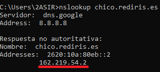

# Tema 2 - DNS (<em>Domain Name System</em>)

## Índice

- [Inicio](../README.md)
- [Introducción](../Tema%200/Ejercicios.md)
- [Servidores Web](../Tema%201/Ejercicios.md)

- <details><summary>Domain Name System (DNS)</summary>

  - [Introducción](#introducción)
  - [Nslookup](#actividad-2---nslookup)
  - [Master Zone](#ejercicio-de-6---master-dns)
  - [Actividad 5](#)

</details>

- [Contenedores en la nube - Docker](../Tema%205%20-%20Docker/ejercicios.md)
- [AWS - Amazon Web Services](../Tema%204%20AWS/Ejercicios.md)

<br>

## Actividad #2 - NsLookup

### Ejercicio 1

#### La UHU (Universidad de Huelva) tiene varios servidores DNS. Consulta a tu servidor DNS por defecto sus direcciones IP al menos 2 de ellos.

Utilizamos el comando:

````
nslookup -type=ns uhu.es
````

Con el que obtendremos la lista de servidores DNS asociados al dominio que consultemos.


<br>

Luego emplearemos el comando con el que obtendremos la IP:

````
nslookup 'nombre del servidor DNS'
````




<br>

### Actividad #2

#### ¿Son las respuestas anteriores autoritativas? 

Al no venir de un servidor autoritativo, la información no es fiable, por lo tanto no es autoritativa.

<br>

### Actividad #3

#### Consulta la dirección IP de un servidor de correo de uhu.es.

Utilizamos el comando:

````
nslookup -type=mx uhu.es dns.uhu.es
````

Con el que obtendremos la IP del servidor de correo asociado al dominio que consultemos.


<br>

### Actividad #4

#### ¿Son las respuestas anteriores autoritativas? 

Sí, ya que comprobamos que la informción solicitada proviene de un servidor autoritativo del dominio.

<br>

### Actividad #5

#### Si hay más de un servidor dns autoritativo para el dominio uhu.es, ¿cómo sabemos cuál es el primario? ¿en qué fecha se actualizó por última vez? ¿cúal es la dirección e-mail del administrador?

Utilizamos el siguiente comando:

````
nslookup -type=soa uhu.es dns-1.uhu.es
````


Del que obtenemos:

Servidor primario: <b>master.infoblox</b><br>
Última fecha de actualización: <b>Hace 4 horas</b><br>
La dirección e-mail del administrador la encontramos en: <b>responsible mail addr</b><br>

Aunque observamos que no se encuentra definida.

<br>

### Actividad #6

#### Comprueba que el DNS inverso está bien configurado para dns-1.uhu.es.

Consultamos la dirección IP del servidor dns-1.uhu.es con el siguiente comando:
````
nslookup dns-1.uhu.es
````


<br>

Obtenemos que la dirección IP es 150.214.167.1.
Ahora realizamos el DNS inverso con el siguiente comando:

````
nslookup 150.214.167.1
````


Comprobamos que la busqueda nos devuelve el nombre del servidor dns-1.uhu.es. Por lo tanto, el DNS inverso está bien configurado.

<br>

### Actividad #7

#### Comprueba que el DNS inverso está bien configurado para www.bp.com.

Consultamos la dirección IP del dominio www.bp.com con el siguiente comando:
````
nslookup bp.com
````


<br>

Obtenemos que la dirección IP es 54.72.215.189
Ahora realizamos el DNS inverso con el siguiente comando:

````
nslookup 54.72.215.189
````


<br>

### Actividad #8

#### Por defecto, el comando NSLOOKUP devuelve los registros de tipo A. ¿Qué se obtiene al consultar los registros NS? Se obtienen los servidores autoritativos para un dominio.

Para consultar los registros de tipo ns, añadimos a nuestro comando el parámetro -type=ns. Utilizamos el comando:

````
nslookup -type=ns Nombre_Dominio
````

Con <b>-type=ns</b> obtendremos los nombres de los servidores DNS autoritaticos asociados al dominio que estamos consultando.

<br>

### Actividad #9

#### Consulta el TLD de las páginas de España: “es”.

Empleamos el siguiente comando:

````
nslookup -type=ns es
````


<br>

### Actividad #10

#### ¿Puede un mismo nombre de dominio traducirse en varias direcciones IP distintas? 

Sí, en la mayoría de caso se desea una alta disponibilidad, por ello un mismo dominio tiene varios servidores de respaldo, lo que se traduce como que un mismo dominio tenga varias IP.

### Actividad #11

#### ¿Quién decide a cuál de las direcciones IP se envía una petición? 

El <em>DNS resolver local</em> es quien se encargará de decidir a cuál de las direcciones IP se envía una petición. El DNS resolver procesará la solicitud y se encargará de dar la dirección IP correcta.

## Servidor Caché y Forwarding - Bind9

Mantenemos actualizados los paquetes de Ubuntu con los siguientes comandos:

````
sudo apt update
sudo apt upgrade -y
````

Instalamos BIND:
````
sudo apt install bind9 bind9utils bind9-doc -y
````

Para el caché del DNS solo debemos de modificar este archivo

```
sudo nano /etc/bindnamed.conf.options
```

Una vez abierto el archivo quitamos todo los comentarios, y nos debrá quear una cosa así.

````
options {
      directory "/var/cache/bind";

      dnssec-validation auto;

      auth-nxdomain no;    # conform to RFC1035
      listen-on-v6 { any; };

      recursion yes;
      allow-query { goodclients; };

      forwarders {
                8.8.8.8;
                8.8.4.4;
      };
      forward only;

      dnssec-enable yes;
      dnssec-validation yes;
};
````
````
acl goodclients {
    192.0.2.0/24;
    localhost;
    localnets;
};
````


imagen

Reiniciamos el servicio de Bind

````
sudo systemctl restart bind9
````

En la máquina cliente ponemos de DNS la ip del equipo con el servicio bind9 y realizamos una consulta:

imagen
