# AWS (<em>Amazon Web Services</em>)

## Índice

- [Inicio](../README.md)
- [Tema 0 - Introducción](../Tema%200/Ejercicios.md)
- [Tema 1 - Servidores Web](#Tema-X-Placeholder)
- [Tema 2 - DNS](#Tema-X-Placeholder)

- <details><summary>AWS - Amazon Web Services</summary>

  - [Introducción](#)
  - [Creación de instancias](#)
  - [Apache y PHP](#)
  - [Creación de la base de datos](#)
  - [Elastic File System (EFS)](#)
  - [Descarga de Wordpress](#)

</details>

- [Tema 3 - Placeholder](#Tema-X-Placeholder)

<br>

## Introducción

<em>Amazon Web Services</em> (AWS) es una plataforma de computación en la nube que ofrece una amplia variedad de servicios para el almacenamiento, procesamiento, redes y bases de datos. Es utilizada por empresas y desarrolladores para desplegar aplicaciones escalables y seguras sin necesidad de administrar infraestructura física.

## Creación de instancias
La creación de instancias en AWS se realiza a través del servicio Amazon Elastic Compute Cloud, conocido como EC2. Permite lanzar y gestionar máquinas virtuales configurando el sistema operativo, el tipo de instancia y los permisos de acceso. Tras su creación, es posible conectarse a la instancia y configurarla según las necesidades del usuario.

Antes de crear nuestra instancia, deberemos establecer una <em>Virtual Private Cloud</em> (VPC) con la que trabajaremos . Una VPC es una red virtual privada que nos permite configurar subredes, direcciones IP y seguridad para nuestras instancias. Además , debemos crear un Grupo de Seguridad que nos permita configurar las reglas de acceso a nuestra instancia.

### Grupos de Seguridad
Creamos nuestro grupo de seguridad dejando abierto los puertos 80, 22 y 443, asignamos el grupo en nuestra VPC. 
<br></br>
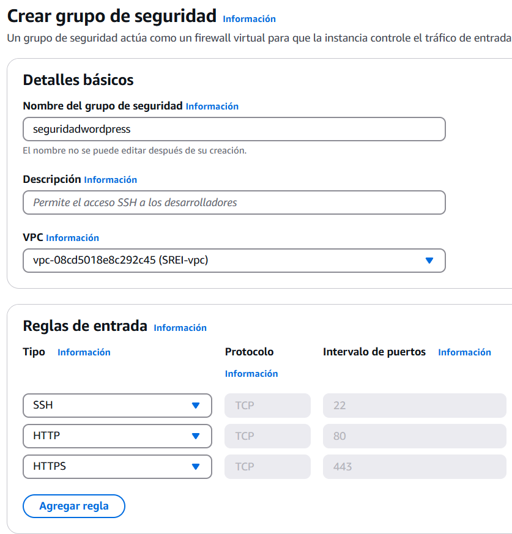

### Configuración de la instancia
Lanzamos una instancia con Ubuntu server
<br></br>
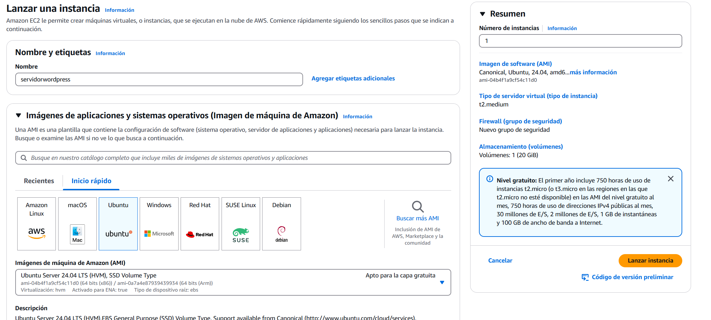

#### Asignación del grupo de seguridad a nuestra instancia
Vamos a la pestaña de Configuraciones de red, editamos la configuración de red y seleccionamos el grupo de seguridad que creamos anteriormente. También asignaremos nuestra VPC.
<br></br>
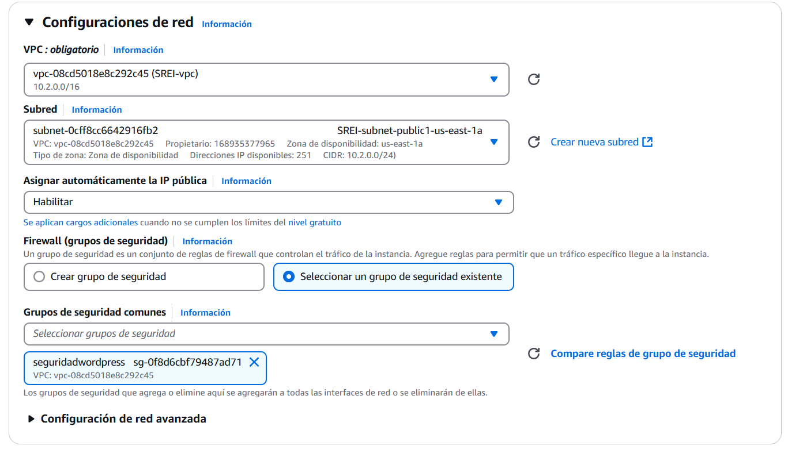

Finalmente entramos en nuestra máquina sin problemas.
<br></br>
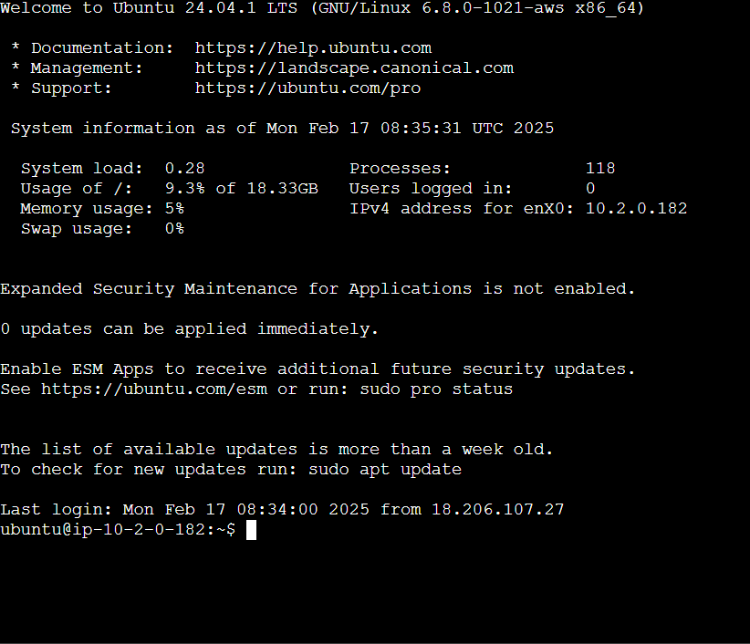

## Apache y PHP
Para servir aplicaciones web en AWS, se puede instalar un servidor Apache junto con PHP en una instancia EC2. Apache es un servidor web ampliamente utilizado, y PHP es un lenguaje de programación para el desarrollo de aplicaciones dinámicas. Tras la instalación, se pueden crear archivos PHP y verificar su correcto funcionamiento a través del navegador.

### Instalación 

#### Apache
Actualizamos los paquetes de Ubuntu y luego instalamos Apache y PHP. Para ello haremos un comando <em>update</em> y posteriormete <em>upgrade</em> con los comandos:
````
sudo apt update
sudo apt upgrade
````
Luego instalamos Apache con los siguientes comandos:
````
sudo apt install apache2
````
Para arrcancar el servidor utilizamos el comando:
````
sudo systemctl start apache2
````
Y para habilitar el arranque cada vez que la instancia se inicie:
````
sudo systemctl enable apache2
````
<br>
Vemos que Apache está funcionando correctamente.
<br></br>
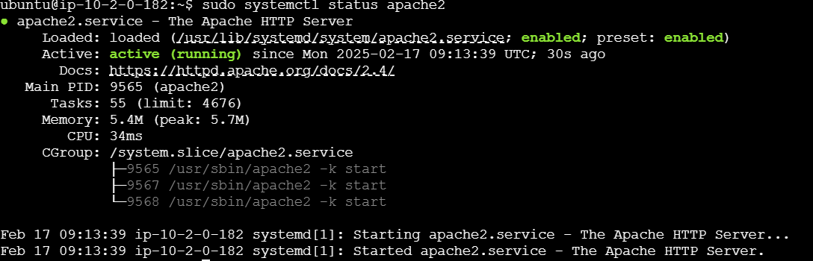

#### PHP
Instalamos PHP con el comando:
````
sudo apt install php8.2 libapache2-mod-php8.2 php8.2-cli
````
También instalaremos MySQL para la base de datos:
````
sudo apt install php8.2-mysql
````
**NOTA:**<br>
En caso de no poder instalar PHP y sus módulos, ejecutar primero el comando:
````
sudo add-apt-repository ppa:ondrej/php -y
````


<br>
Ahora nos tocará simplemente reiniciar Apache y comprobar que todo está instalado.
Para comprobar que Apache funciona, accedemos a la dirección publica de nuestra instancia.
<br></br>
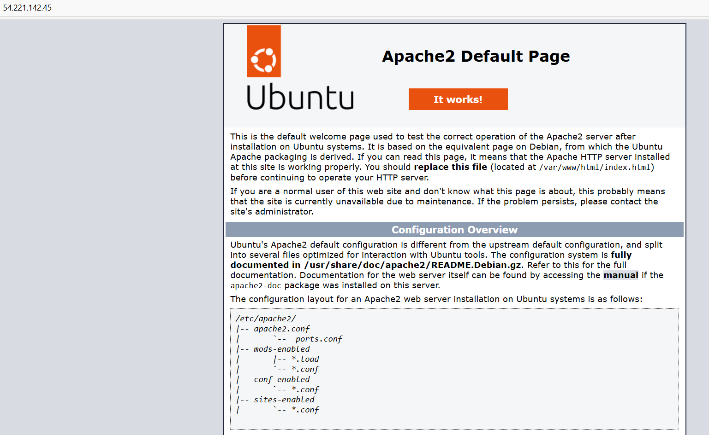

## Creación de la base de datos
AWS ofrece Amazon RDS para gestionar bases de datos en la nube. Al crear una base de datos en este servicio, se elige un motor como MySQL o PostgreSQL, se configuran los recursos asignados y se definen credenciales de acceso. Posteriormente, la base de datos puede ser gestionada y utilizada desde las instancias EC2 o cualquier otro servicio de AWS que la requiera.

#### Base de datos MySQL

Desde la pestaña de RDS en AWS, seleccionamos crear una nueva base de datos, luego seleccionamos MySQL como motor de nuestra base de datos.
<br></br>
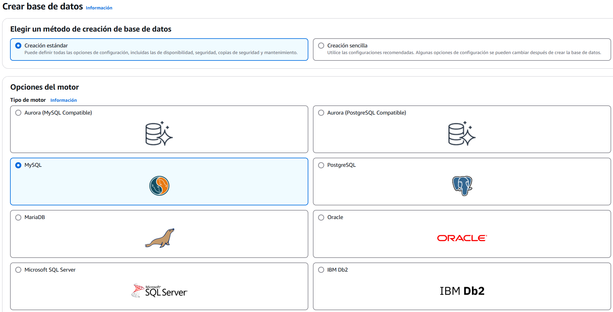
<br></br>
Seleccionamos **Capa gratuita**
<br></br>
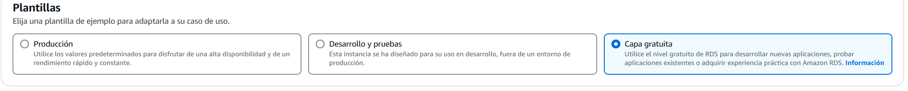
<br></br>
Configuramos el identficador y las credenciales de la Base de Datos.
<br></br>
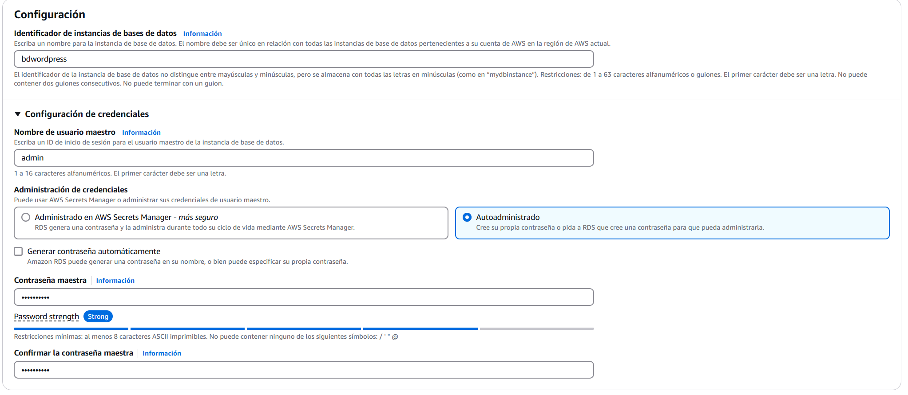
<br></br>
Ahora nos toca ajustar las diferentes opciones de conectividad y seguridad. Asignamos nuestra VPC y grupo de seguridad
<br></br>
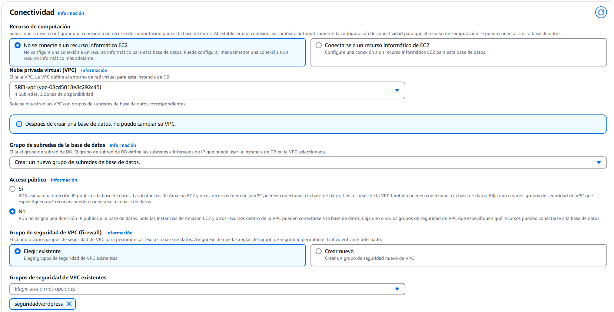
<br></br>
Finalmente deberemos inevitablemente poner nombre al campo **Nombre de la base de datos incial**
<br></br>
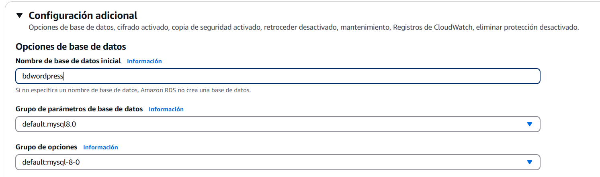
<br></br>
Ahora acudimos al panel de nuestras bases de datos y seleccionamos la base de datos que acabamos de crear clicamos en Acciones y luego en **Configurar la conexión de EC2**, seleccionamos nuestra instancia y damos en **Continuar**.
<br></br>
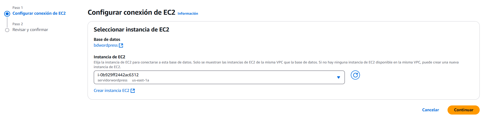


## Elastic File System (EFS)
<em>Amazon Elastic File System</em> (EFS) permite compartir un sistema de archivos entre varias instancias EC2. Para utilizarlo, se crea un sistema de archivos desde la consola de AWS y se configura su acceso para que pueda ser montado en una instancia. Esto facilita el almacenamiento y acceso a archivos desde múltiples servidores sin necesidad de configuraciones complejas.

## Descarga de Wordpress
Para descargar e instalar WordPress en una instancia EC2, se obtiene el paquete oficial desde su sitio web y se descomprime en el directorio adecuado del servidor web. Posteriormente, se configuran los archivos necesarios para conectar WordPress con la base de datos y completar la instalación a través del navegador. Esto permite desplegar un sitio web funcional en AWS con facilidad.