# Tema 5 Docker (<em>Contenedores en la nube</em>)

## Índice

- [Inicio](../README.md)
- [Introducción](../Tema%200/Ejercicios.md)
- [Servidores Web](../Tema%201/Ejercicios.md)
- [Domain Name System (DNS)](../Tema%202/Ejercicios.md)

- <details><summary>Docker</summary>

  - [Introducción](#introducción)
  - [Actividad 2](#)
  - [Actividad 3](#)
  - [Actividad 4](#)
  - [Actividad 5](#)

</details>

- [AWS - Amazon Web Services](../Tema%204%20AWS/Ejercicios.md)

<br>

## Introducción

Plataforma que permite desarrollar, empaquetar y ejecutar aplicaciones en contenedores, proporcionando un entorno portátil y consistente. A diferencia de las máquinas virtuales, los contenedores comparten el kernel del sistema operativo, lo que optimiza el uso de recursos y mejora la eficiencia.  

Su uso simplifica el despliegue de aplicaciones al evitar problemas de compatibilidad entre entornos y facilita la escalabilidad. En esta guía, exploraremos las bases de Docker, haciendo gestión de contenedores e imágenes.


## Actividad 2

### Get-Started - Articulo 1

#### Ejecutar la imagen hello-world

Comenzamos con la ejecución de una imagen de Docker. Para ello, debemos tener instalado Docker en nuestro sistema. Una vez instalado , podemos ejecutar la siguiente orden en la terminal:

````
sudo docker run hello-world
````


#### Imagenes locales

Para comprobar las imagenes locales en Docker , podemos utilizar la siguiente orden:

````
sudo docker images -a
````


#### Mostrar todos los contenedores Docker

En caso de que queramos ver todos los contenedores que se han ejecutado en nuestro sistema, podemos utilizar la siguiente orden:

````
sudo docker ps -a
````


### Get-Started Part 2 - Articulo 2

#### Editar el archivo DockerFile

Un Dockerfile es un archivo de texto que contiene un conjunto de instrucciones para construir una imagen de Docker de manera automatizada. Permite definir el entorno, las dependencias y la configuración necesaria para ejecutar una aplicación dentro de un contenedor.

Para editar el archivo Dockerfile, podemos utilizar cualquier editor de texto, aqui emplearemos <em>nano</em> con el siguiente comando:

````
sudo nano RUTA/Dockerfile
````


#### Construir el contenedor

Si queremos construir nuestro primer contenedor, podemos utilizar la siguiente orden:

````
sudo docker build -t NOMBRE-IMAGEN .
````


#### Ejecutar el contenedor

La ejecución de nuestro contenedor se puede realizar con la siguiente orden:

````
sudo docker run -d -p 127.0.0.1:3000 getting-started
````


#### Publicar la imagen en Docker Hub

Para publicar nuestra imagen en Docker Hub, debemos primero crear una cuenta en el sitio web de Docker Hub.


Una vez que tengamos una cuenta, debemos iniciar sesión en la consola con el siguiente comando:

````
sudo docker login -u NombreUsuario
````


Con todo ello , ya podemos publicar nuestra imagen en Docker Hub con el siguiente comando:

````
sudo docker push davidfau/gettingstarted
````


## Actividad 3

---

### 1. Descargar imágenes de Docker
Ejecuta los siguientes comandos para descargar las imágenes necesarias:

```sh
docker pull ubuntu
docker pull hello-world
docker pull nginx
```


Para verificar que las imágenes se han descargado correctamente, usa:

```sh
docker images -a
```


---

### 2. Ejecutar contenedores
Lanza tres contenedores basados en la imagen `hello-world` con nombres específicos:

```sh
docker run --name myhello1 hello-world
docker run --name myhello2 hello-world
docker run --name myhello3 hello-world
```


ℹ️ **Nota:** `hello-world` es una imagen de prueba que se ejecuta y finaliza inmediatamente.
Para ver la lista de contenedores creados (ejecutados o detenidos), usa:

```sh
docker ps -a
```

---

## 3. Mostrar contenedores en ejecución
Para listar solo los contenedores en ejecución:

```sh
docker ps
```


---

## 4. Detener contenedores
Si algún contenedor sigue en ejecución, puedes detenerlo con:

```sh
docker stop myhello1
docker stop myhello2
```


---

## 5. Eliminar contenedores
Para eliminar un contenedor específico:

```sh
docker rm myhello1
```


Para verificar los contenedores después de eliminar uno:

```sh
docker ps -a
```

Para eliminar **todos los contenedores**, ejecuta:

```
docker ps -aq | xargs docker rm
```


⚠️ **Precaución:** Este comando elimina **todos** los contenedores, incluso los detenidos.

---

## Actividad 4

### GuestBook - Ejemplo 1


En este ejemplo vamos a desplegar una aplicación web que requiere de dos servicios (servicio web y servicio de base de datos) para su ejecución. La aplicación se llama **GuestBook** y necesita los siguientes servicios:

- La aplicación *guestbook* es una aplicación web desarrollada en *Python* que es servida por el puerto `5000/tcp`. Utilizaremos la imagen `iesgn/guestbook`.
- Esta aplicación guarda la información en una base de datos no relacional *Redis*, que utiliza el puerto `6379/tcp` para conectarnos. Usaremos la imagen `redis`.

## Volúmenes

Según la documentación de la imagen *Redis* en [Docker Hub](https://hub.docker.com/_/redis), para que la información de la base de datos se guarde en el directorio `/data` del contenedor, es necesario ejecutar el proceso `redis-server` con los argumentos `--appendonly yes`.

## Redes

La aplicación *guestbook* usa por defecto el nombre `redis` para conectarse a la base de datos. Para garantizar una resolución de nombres adecuada, debemos nombrar al contenedor Redis como `redis`.

Ambos contenedores deben estar en la misma red para que puedan comunicarse mediante nombres en lugar de direcciones IP. Para ello, creamos una red en Docker:

```bash
docker network create red_guestbook
```


### Despliegue de los contenedores

Ejecutamos los contenedores de Redis y Guestbook en la misma red:

````bash
docker run -d --name redis --network red_guestbook -v /opt/redis:/data redis redis-server --appendonly yes
````


````
docker run -d -p 80:5000 --name guestbook --network red_guestbook iesgn/guestbook
````


### Observaciones

- No es necesario mapear el puerto de `redis`, ya que no accederemos a él desde el exterior. Sin embargo, la aplicación *guestbook* podrá acceder a la base de datos porque ambos contenedores están en la misma red.
- Al nombrar el contenedor de la base de datos como `redis`, Docker crea una entrada DNS que asocia ese nombre con la IP del contenedor. La aplicación *guestbook* usa este nombre para conectarse automáticamente.
- Si eliminamos el contenedor de `redis` y lo volvemos a crear, podemos comprobar que la información persiste gracias al volumen montado en `/opt/redis`.


## Configuración de la aplicación Guestbook

En la imagen `iesgn/guestbook`, se ha definido una variable de entorno llamada `REDIS_SERVER`, que indica el nombre del servidor de base de datos Redis al que se conectará la aplicación. Su valor por defecto es `redis`.

Si creamos un contenedor Redis con otro nombre, por ejemplo:

````bash
docker run -d --name contenedor_redis --network red_guestbook -v /opt/redis:/data redis redis-server --appendonly yes
````

Entonces, debemos configurar la aplicación *guestbook* para que use ese nuevo nombre. Para ello, pasamos la variable de entorno `REDIS_SERVER` al crear el contenedor:

````bash
docker run -d -p 80:5000 --name guestbook -e REDIS_SERVER=contenedor_redis --network red_guestbook iesgn/guestbook
````

---

### Temperaturas - Ejemplo 2


Este proyecto despliega una aplicación llamada **Temperaturas**, que permite consultar la temperatura mínima y máxima de todos los municipios de España. Está formada por dos microservicios: **frontend** y **backend**.

### Descripción de los microservicios

1. **Frontend**: Es una aplicación escrita en Python que nos ofrece una página web para realizar búsquedas y visualizar los resultados. Este microservicio hace peticiones HTTP al segundo microservicio para obtener la información. Ofrece el servicio en el puerto `3000/tcp`. Usamos la imagen `iesgn/temperaturas_frontend`.
   
2. **Backend**: Es el segundo microservicio que ofrece un servicio web tipo API Restful. A esta API podemos hacer consultas sobre los municipios y las temperaturas. El servicio está disponible en el puerto `5000/tcp`. Usamos la imagen `iesgn/temperaturas_backend`.

El microservicio **frontend** se conecta al **backend** usando el nombre `temperaturas-backend`. Por lo tanto, el contenedor del microservicio **backend** tendrá ese nombre para asegurar la correcta resolución de nombres en el DNS de Docker.

## Requisitos

- Docker
- Docker Compose (opcional, pero recomendado para simplificar la gestión de contenedores)

## Pasos de despliegue

### 1. Crear una red Docker

Primero, crea una red para permitir la comunicación entre los contenedores:

````
docker network create red_temperaturas
````


### 2. Desplegar el microservicio Backend

El microservicio Backend se ejecutará en el contenedor temperaturas-backend, usando la imagen iesgn/temperaturas_backend. Este contenedor no necesita mapear puertos externos, ya que Frontend se conectará a él internamente.

````
docker run -d --name temperaturas-backend --network red_temperaturas iesgn/temperaturas_backend
````

### 3. Desplegar el microservicio Frontend

El microservicio Frontend se ejecutará en el contenedor temperaturas-frontend. Este contenedor expone el puerto 3000/tcp, pero lo mapearemos al puerto 80 del host para facilitar el acceso desde el navegador.

````
docker run -d -p 80:3000 --name temperaturas-frontend --network red_temperaturas iesgn temperaturas_frontend
````


### 4. Acceso a la aplicación
Una vez que ambos contenedores estén en ejecución, la aplicación estará disponible en http://localhost o http://<dirección_ip_del_servidor>. Desde allí podrás realizar las búsquedas de temperatura.


### Tomcat + Nginx - Ejemplo 3

En este ejemplo vamos a desplegar una aplicación simple utilizando **Tomcat** como servidor de aplicaciones y **Nginx** como proxy inverso. Usaremos redes **bridge** personalizadas y **bind mounts** para enlazar los archivos de configuración entre el host y los contenedores.

#### 1. Crear la red bridge

Primero, creamos una red **bridge** personalizada para conectar los contenedores:

````bash
docker network create red_tomcat
````


#### 2. Desplegar Tomcat
A continuación, vamos a ejecutar el contenedor de Tomcat con un archivo .war que montamos desde el host. El archivo se coloca en el directorio /usr/local/tomcat/webapps/ dentro del contenedor.

Suponiendo que tenemos el archivo .war en el directorio adecuado (~/tomcat/sample.war), creamos el contenedor:

````
docker run -d --name aplicacionjava \
                --network red_tomcat \
                -v /home/vagrant/tomcat/sample.war:/usr/local/tomcat/webapps/sample.war:ro \
                tomcat:9.0
````


#### 3. Configurar Nginx como Proxy Inverso
Ahora, configuramos Nginx para que actúe como un proxy inverso que redirige las solicitudes al contenedor Tomcat. La configuración de Nginx se encuentra en el archivo default.conf, donde usamos la directiva proxy_pass para dirigir las peticiones hacia el contenedor Tomcat.

El archivo de configuración default.conf es el siguiente:

````nginx
server {
    listen       80;
    listen  [::]:80;
    server_name  localhost;

    location / {
        proxy_pass http://aplicacionjava:8080/sample/;
    }

    error_page   500 502 503 504  /50x.html;
    location = /50x.html {
        root   /usr/share/nginx/html;
    }
}
````


Para crear el contenedor Nginx con esta configuración, ejecutamos:

````
docker run -d --name proxy \
                -p 80:80 \
                --network red_tomcat \
                -v /home/vagrant/tomcat/default.conf:/etc/nginx/conf.d/default.conf:ro \
                nginx

````


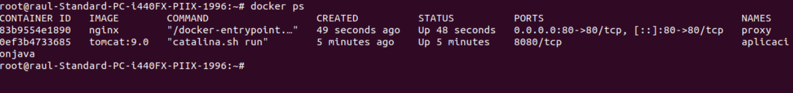

#### 4. Acceder a la Aplicación
Una vez que ambos contenedores están funcionando, puedes acceder a la aplicación a través de la IP de tu servidor o http://localhost. Esto redirigirá la solicitud al contenedor Tomcat a través de Nginx, mostrando la aplicación desplegada.


## Actividad 5

### GuestBook - Ejemplo 1

Este ejemplo muestra cómo desplegar la aplicación *Guestbook* utilizando **Docker Compose**. Puedes encontrar el archivo `docker-compose.yaml` en este [repositorio](https://github.com/josedom24/curso_docker_ies/tree/main/ejemplos/modulo4/ejemplo1).

El archivo `docker-compose.yaml` define dos servicios: uno para la aplicación *Guestbook* y otro para la base de datos *Redis*. A continuación, el contenido del archivo:

````yaml
version: '3.1'
services:
  aplicacionjava:
    container_name: tomcat
    image: tomcat:9.0
    restart: always
    volumes:
      - ./sample.war:/usr/local/tomcat/webapps/sample.war:ro
  proxy:
    container_name: nginx
    image: nginx
    ports:
      - 80:80
    volumes:
      - ./default.conf:/etc/nginx/conf.d/default.conf:ro
````

Para levantar los contenedores, ejecuta el siguiente comando en el directorio donde esté el archivo docker-compose.yaml:

````bash
docker compose up -d
````


Recordamos como comprobar los contenedores que están en ejecución con:
````
docker compose ps
````


#### Acceder a la Aplicación
Una vez que ambos contenedores están funcionando, puedes acceder a la aplicación a través de la IP de tu servidor o http://localhost. Esto redirigirá la solicitud al contenedor Tomcat a través de Nginx, mostrando la aplicación desplegada.


### Temperaturas - Ejemplo 2

Este ejemplo muestra cómo desplegar la aplicación *Temperaturas* utilizando **Docker Compose**. Puedes encontrar el archivo `docker-compose.yaml` en este [repositorio](https://github.com/josedom24/curso_docker_ies/tree/main/ejemplos/modulo4/ejemplo2).

El archivo `docker-compose.yaml` define dos servicios: uno para la aplicación *Guestbook* y otro para la base de datos *Redis*. A continuación, el contenido del archivo:

````yaml
version: '3.1'
services:
  frontend:
    container_name: temperaturas-frontend
    image: iesgn/temperaturas_frontend
    restart: always
    ports:
      - 8081:3000
    environment:
      TEMP_SERVER: temperaturas-backend:5000
    depends_on:
      - backend
  backend:
    container_name: temperaturas-backend
    image: iesgn/temperaturas_backend
    restart: always
````

Para levantar los contenedores, ejecuta el siguiente comando en el directorio donde esté el archivo docker-compose.yaml:

````bash
docker compose up -d
````


Recordamos como comprobar los contenedores que están en ejecución con:
````
docker compose ps
````


#### Acceder a la Aplicación
Una vez que ambos contenedores están funcionando, puedes acceder a la aplicación a través de la IP de tu servidor o http://localhost. Esto redirigirá la solicitud al contenedor Tomcat a través de Nginx, mostrando la aplicación desplegada.


### Tomcat + Nginx - Ejemplo 3

Este ejemplo muestra cómo desplegar la aplicación *Tomcat* y *Nginx* utilizando **Docker Compose**. Puedes encontrar el archivo `docker-compose.yaml` en este [repositorio](https://github.com/josedom24/curso_docker_ies/tree/main/ejemplos/modulo4/ejemplo3).

El archivo `docker-compose.yaml` define dos servicios: uno para la aplicación *Guestbook* y otro para la base de datos *Redis*. A continuación, el contenido del archivo:

````yaml
version: '3.1'
services:
  aplicacionjava:
    container_name: tomcat
    image: tomcat:9.0
    restart: always
    volumes:
      - ./sample.war:/usr/local/tomcat/webapps/sample.war:ro
  proxy:
    container_name: nginx
    image: nginx
    ports:
      - 80:80
    volumes:
      - ./default.conf:/etc/nginx/conf.d/default.conf:ro
````

Para levantar los contenedores, ejecuta el siguiente comando en el directorio donde esté el archivo docker-compose.yaml:

````bash
docker compose up -d
````


Recordamos como comprobar los contenedores que están en ejecución con:
````
docker compose ps
````


#### Acceder a la Aplicación
Una vez que ambos contenedores están funcionando, puedes acceder a la aplicación a través de la IP de tu servidor o http://localhost. Esto redirigirá la solicitud al contenedor Tomcat a través de Nginx, mostrando la aplicación desplegada.


## Actividad 6

### Ejemplo 1

#### Creación de una Imagen a partir de un Contenedor

Normalmente utilizamos imágenes preexistentes de Docker Hub, pero en muchos casos necesitamos personalizar una imagen para adaptarla a nuestras necesidades. Esto es lo que se conoce como "dockerizar" una aplicación.

Una forma sencilla de hacerlo es modificar un contenedor en ejecución y luego guardar esos cambios en una nueva imagen.

### Pasos para Crear una Imagen desde un Contenedor

#### 1. Iniciar un Contenedor desde una Imagen Base
Para comenzar, ejecutamos un contenedor interactivo basado en una imagen base.

````bash
 docker run -it --name mi_contenedor debian bash
````

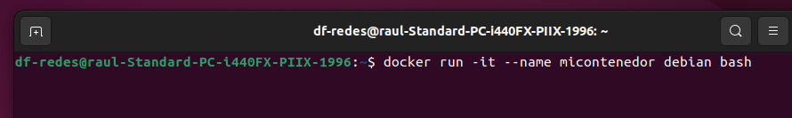

#### 2. Realizar Modificaciones
Dentro del contenedor podemos instalar paquetes, modificar archivos, o realizar cualquier otra personalización.

````bash
root@contenedor:/# apt update && apt install -y apache2
root@contenedor:/# echo "<h1>Mi Servidor Web</h1>" > /var/www/html/index.html
root@contenedor:/# exit
````

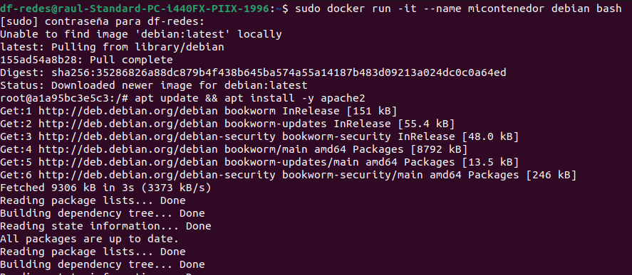

#### 3. Crear una Imagen desde el Contenedor
Usamos `docker commit` para capturar los cambios realizados en una nueva imagen.

````bash
 docker commit mi_contenedor usuario/miapache:v1
````

Podemos verificar que la imagen se ha creado correctamente con:

````bash
$ docker images
REPOSITORY             TAG    IMAGE ID      CREATED        SIZE
usuario/miapache      v1     abc123        10 seconds ago  243MB
````

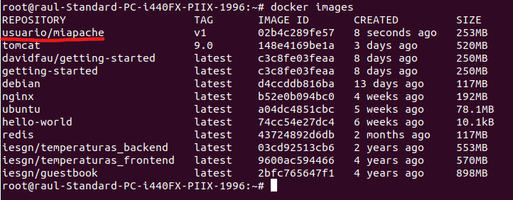


### 4. Crear un Contenedor desde la Nueva Imagen
Para ejecutar nuestra imagen personalizada, es necesario indicar el proceso principal que debe ejecutarse al iniciarse el contenedor.

```bash
 docker run -d -p 8080:80 \
             --name servidor_web \
             usuario/miapache:v1 \
             bash -c "apache2ctl -D FOREGROUND"
```

Ahora podemos acceder a nuestro servidor web en `http://localhost:8080`.

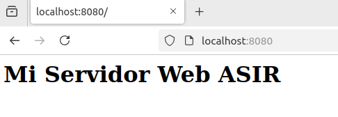


### Ejemplo 2

En este ejemplo, crearemos una imagen Docker que sirva una página estática. Se generarán tres versiones distintas utilizando diferentes imágenes base. Puedes encontrar los archivos en este [repositorio](https://github.com/josedom24/curso_docker_ies/tree/main/ejemplos/modulo5/ejemplo1).

### Versión 1: Usando una Imagen Base

El contexto del proyecto incluye un `Dockerfile` y un directorio `public_html` con la página web:

````bash
$ ls
Dockerfile  public_html
````

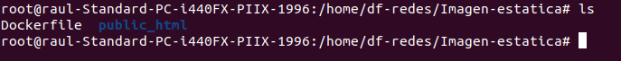

El `Dockerfile` se basa en una imagen mínima de Debian e instala Apache2:

````Dockerfile
# syntax=docker/dockerfile:1
FROM debian:stable-slim
RUN apt-get update && apt-get install -y apache2 && apt-get clean && rm -rf /var/lib/apt/lists/*
WORKDIR /var/www/html/
COPY public_html .
EXPOSE 80
CMD apache2ctl -D FOREGROUND
````

Construimos la imagen y verificamos su creación:

````bash
docker build -t usuario/ejemplo1:v1 .
docker images
````

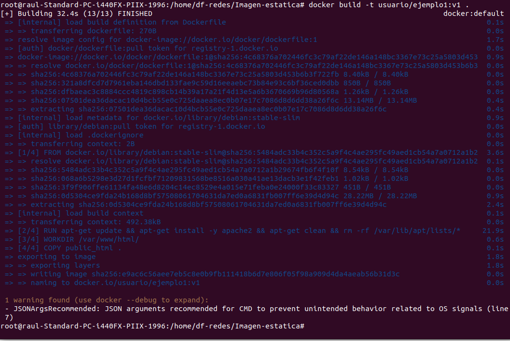

---

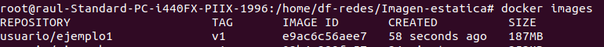

Ejecutamos el contenedor:

````bash
docker run -d -p 80:80 --name ejemplo1 usuario/ejemplo1:v1
````

Ahora podemos acceder a la página web desde el navegador.

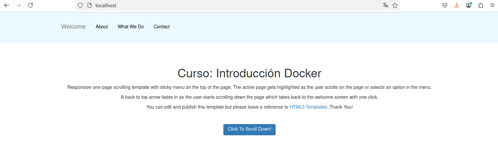

### Versión 2: Usando una Imagen con Apache2

En esta versión, usamos una imagen que ya incluye Apache2, simplificando el `Dockerfile`:

````Dockerfile
# syntax=docker/dockerfile:1
FROM httpd:2.4
COPY public_html /usr/local/apache2/htdocs/
EXPOSE 80
````

Construcción y ejecución:

````bash
docker build -t usuario/ejemplo1:v2 .
docker run -d -p 80:80 --name ejemplo1 usuario/ejemplo1:v2
````

## Versión 3: Usando una Imagen con Nginx

Para esta versión, usamos la imagen oficial de Nginx:

````Dockerfile
# syntax=docker/dockerfile:1
FROM nginx:1.24
COPY public_html /usr/share/nginx/html
EXPOSE 80
````

Construcción y ejecución:

````bash
docker build -t usuario/ejemplo1:v3 .
docker run -d -p 80:80 --name ejemplo1 usuario/ejemplo1:v3
````


### Ejemplo 3

### Construcción de Imágenes con una Aplicación Python

En este ejemplo, crearemos una imagen Docker para desplegar una aplicación web en Python con Flask. La aplicación se ejecutará en el puerto `3000/tcp`.

Puedes encontrar los archivos necesarios en este [directorio](https://github.com/josedom24/curso_docker_ies/tree/main/ejemplos/modulo5/ejemplo3) del repositorio.

### Estructura del Proyecto
El contexto del proyecto incluye:
- Un fichero `Dockerfile`
- Un directorio `app` que contiene la aplicación Python

### Creación de la Imagen desde Debian
Vamos a utilizar una imagen base de Debian sin servicios preinstalados. El `Dockerfile` correspondiente es:

```Dockerfile
# syntax=docker/dockerfile:1
FROM debian:12
RUN apt-get update && apt-get install -y python3-pip && apt-get clean && rm -rf /var/lib/apt/lists/*
WORKDIR /usr/share/app
COPY app .
RUN pip3 install --no-cache-dir --break-system-packages -r requirements.txt
EXPOSE 3000
CMD python3 app.py
```

### Explicación:
- Se instala `pip` para gestionar las dependencias de Python.
- Se copia la aplicación en la imagen.
- Se establece `/usr/share/app` como directorio de trabajo.
- Se instalan las dependencias listadas en `requirements.txt`.
- Se define `CMD` para iniciar el servidor web con `python3 app.py`.

Para construir la imagen:
```bash
$ docker build -t usuario/ejemplo3:v1 .
```

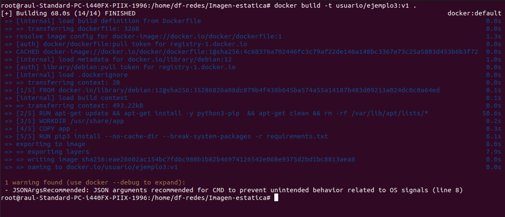

Para verificar la imagen creada:
```bash
$ docker images
```

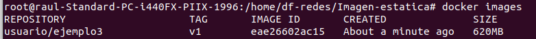


Para ejecutar el contenedor:
```bash
$ docker run -d -p 80:3000 --name ejemplo3 usuario/ejemplo3:v1
```

Ahora puedes acceder a la aplicación en `http://localhost`.

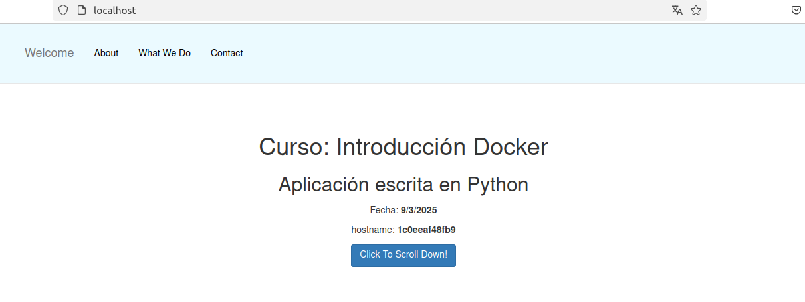

### Versión Alternativa: Desde una Imagen con Python Preinstalado
En lugar de instalar Python manualmente, podemos usar una imagen que ya lo incluya:

```Dockerfile
# syntax=docker/dockerfile:1
FROM python:3.12.1-bookworm
WORKDIR /usr/share/app
COPY app .
RUN pip install --no-cache-dir -r requirements.txt
EXPOSE 3000
CMD python app.py
```

### Diferencias:
- Se usa una imagen base con Python preinstalado (`python:3.12.1-bookworm`).
- No es necesario instalar `pip`, ya que viene incluido en la imagen.

Para construir esta versión:
```bash
$ docker build -t usuario/ejemplo3:v2 .
```

Para ejecutar:
```bash
$ docker run -d -p 80:3000 --name ejemplo3 usuario/ejemplo3:v2
```

Ahora la aplicación estará disponible en `http://localhost`.

---


